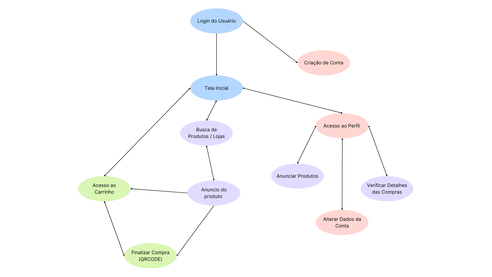

# Sistema de E-Commerce
## Domínio
O sistema pertence ao domínio de comércio eletrônico (e-commerce), permitindo a conexão entre vendedores e compradores para negociação e compra de produtos.

## Escopo
- Cadastro de usuários e produtos
- Busca por produtos
- Gerenciamento de carrinho
- Finalização de pedidos
- Simulação de pagamento
- Envio de Notificações

## Especificação de Requisitos

- Cadastro e login de usuários.
- Cadastro de produtos à venda.
- Busca e listagem de produtos.
- Adicionar produtos ao carrinho.
- Finalização de pedidos com simulação de pagamento.
- Registro de histórico de pedidos.
- Envio de notificações de confirmação por e-mail.

 

## Modelo de Processo: Metodologia Ágil - Kanban

O Kanban foi escolhido por ser uma metodologia ágil enxuta, que permite visualizar o fluxo de trabalho, controlar o progresso das tarefas em tempo real e adaptar as prioridades com flexibilidade. 
